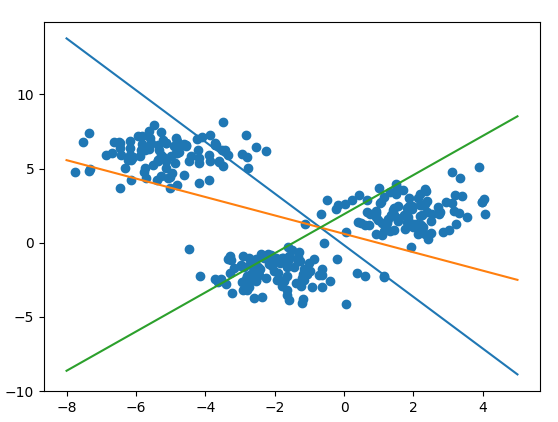

# softmax-regression
In this repository, I have written some code on understanding softmax-regression. In addition, I also tried to get familiar with Pytorch by programming softmax regression in the Pytorch flow as well as using `Dataset` and `DataLoader`.   

The source code, in my view, is easy to read. You can change the mean values of the data or the number of classes in the `main.py` and `softmax_regression.py`, respectively. However, the boundaries drawn after training are valid only if the data is 2-dimensional.   

Here is the example of classifying 3 classes:

## References
- [Softmax Regression](machinelearningcoban.com/2017/02/17/softmax/)
- [Pytorch tutorials](https://pytorch.org/tutorials/beginner/deep_learning_60min_blitz.html)
